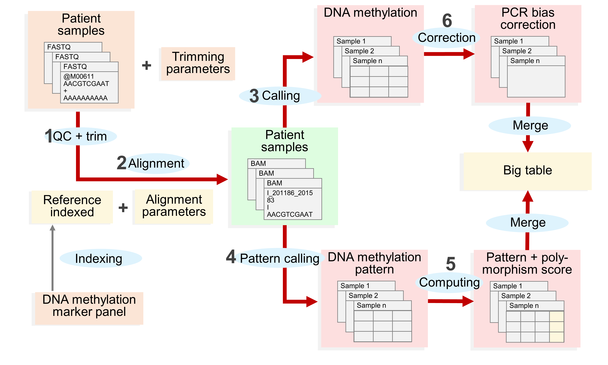
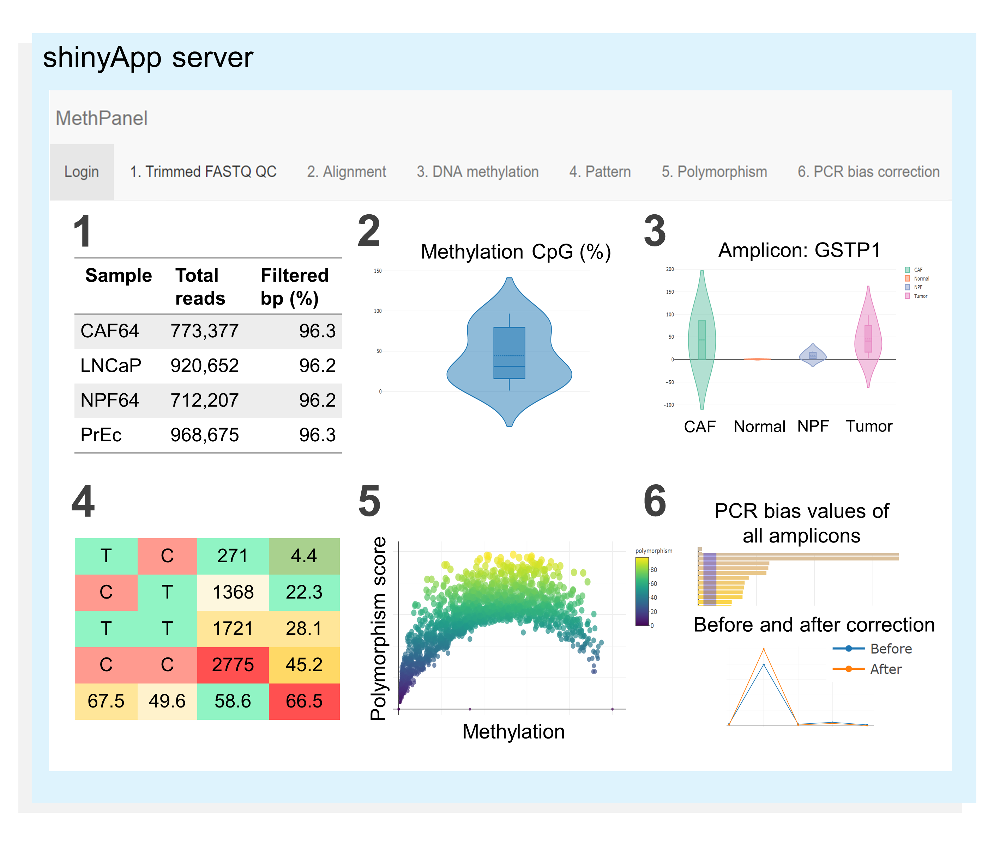

# *MethPanel*

*MethPanel* is a computational pipeline with an interactive graphical interface for rapid analysis multiplex bisulphite PCR sequencing data. The tool covers a complete analysis workflow from genomic alignment to DNA methylation calling and supports an unlimited number of PCR amplicons and input samples. Moreover *MethPanel* offers important and unique features, such as a polymorphism score and a bisulphite PCR bias correction. *MethPanel* can be run in parallel by samples on either a personal computer or a high performance computer, while the outputs are automatically forwarded to a shinyApp for convenient display, visualisation and sharing data across collaborators and clinicians. It means data are centralized, hence easy for storage management.

## *MethPanel* workflow

### Installation
* *MethPanel* is built based on in-house bash/python/R script, Bpipe and a collection of software packages:
  * [bowtie2, 2.2.5]                   http://bowtie-bio.sourceforge.net/bowtie2/index.shtml
  * [Bismark, 0.22.1]                  https://www.bioinformatics.babraham.ac.uk/projects/bismark/
  * [bedtools, 2.26.0]                 https://github.com/arq5x/bedtools2
  * [R, 3.4.0]
  * [samtools, 1.3]                    https://github.com/samtools/
  * [Bpipe, 0.9.9.7]                   https://github.com/ssadedin/bpipe
  * [fastqc, 0.11.5]                   http://www.bioinformatics.babraham.ac.uk/projects/fastqc/
  * [trim_galore, 0.5.0]                 https://www.bioinformatics.babraham.ac.uk/projects/trim_galore/
  * [UCSC-format-file-converter, 1.0]  http://hgdownload.soe.ucsc.edu/admin/exe/linux.x86_64/
  * [ggplot2]                          https://github.com/tidyverse/ggplot2
  * [BSgenome.Hsapiens.UCSC.version]   https://github.com/Przemol/BSgenome.Hsapiens.UCSC.version
  * [GenomicRanges]                    https://github.com/Bioconductor-mirror/GenomicRanges
  * [rtracklayer]                      https://github.com/Bioconductor-mirror/rtracklayer
  * [python, 2.7.11]
  * [python modules] configobj, argparse
  
* Dependencies
  * All the above listed software packages, here are some commands to install python and R packages
    * [python version >= 2.7.11] 
      * pip install configobj argparse
    * [R version >= 3.4.0] 
      * source("https://bioconductor.org/biocLite.R")
      * biocLite(c("BSgenome.Hsapiens.UCSC.hg19", "rtracklayer", "GenomicRanges")) 
      * install.packages(c("shiny", "shinyauthr", "shinyjs", "plotly", "ggplot2", "gplots", "reshape2"))

* Installation
  * git clone git@github.com:/thinhong/MethPanel.git
  * or
  * git clone https://github.com/thinhong/MethPanel.git
  
* Inputs require 
  * Single/paired fastq files in .gz format for each sample
  * Filled sample config file, example https://github.com/thinhong/MethPanel/config/sample.Control_23032018_TME.pre.config
  * Filled system config file, example https://github.com/thinhong/MethPanel/config/system.Control_23032018_TME.pre.config
  * Note: 
       * The fastq files are located in project/raw/LNCaP/LNCaP_R1.fastq.gz,                                        project/raw/LNCaP/LNCaP_R2.fastq.gz (if paired-end) of each sample.

## *MethPanel* shinyApp

For further details manual of *MethPanel* shinyApp: https://github.com/thinhong/MethPanel/wiki
